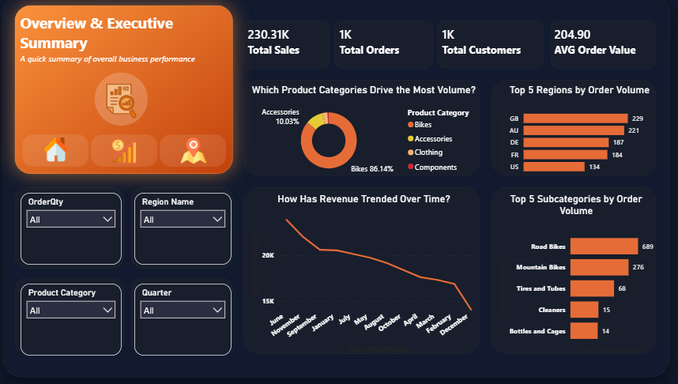
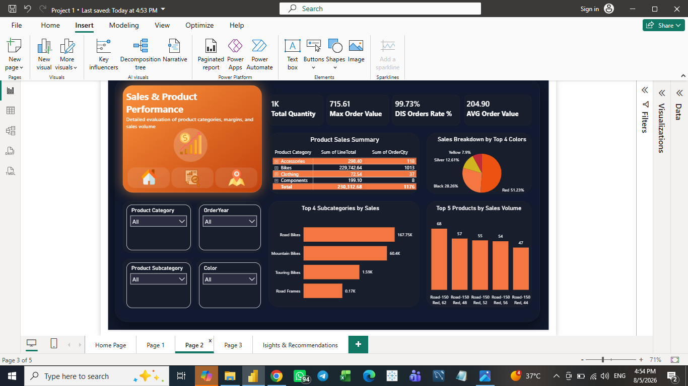
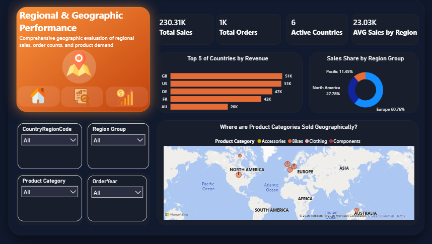

# 📊 Sales Analysis & Business Intelligence Dashboard (Power BI)

An end-to-end interactive Business Intelligence project built in **Power BI**, providing comprehensive insights into global sales performance, product category breakdown, regional distribution, and actionable strategic recommendations.

---

## 📌 Executive Summary

* **Total Revenue:** `$230.31K`
* **Total Orders:** `1,000`
* **Total Customers:** `1,000`
* **Average Order Value (AOV):** `$204.90`
* **Key Revenue Driver:** **Bikes** category represents **86.14%** of total revenue.
* **Top Performing Region:** **Europe** accounts for **60.76%** of global sales share.

---

## 🗺️ Project Architecture & Navigation

The dashboard is structured into an intuitive multi-page layout designed for seamless user experience and deep data exploration.

### 🏠 0. Home Page Layout
The navigation hub allows stakeholders to jump directly to specific analysis pages.


---

### 📈 1. Overview & Executive Summary
High-level view of core KPIs, overall revenue trends, and category distribution.



* **Key Insights:**
  * **Product Share:** Bikes drive **86.14%** of revenue, followed by Accessories (**10.03%**).
  * **Top Subcategory Volume:** **Road Bikes** led in order volume with **689 orders**, followed by Mountain Bikes (**276 orders**).
  * **Top Country Volume:** United Kingdom (**GB**) and Australia (**AU**) led order counts with **229** and **221 orders** respectively.

---

### 🚲 2. Sales & Product Performance
In-depth evaluation of sales metrics, quantities, discounts, and product-level granularity.



* **Key Insights:**
  * **Total Quantity Sold:** `1,176 units` across all product lines.
  * **Discount Rate:** High discount order coverage at **99.73%**.
  * **Color Preference:** Red products dominate sales revenue (**51.23%**), followed by Black (**28.26%**).
  * **Top Selling SKU:** `Road-150 Red, 62` led top individual product volume with **68 units**.

---

### 🌍 3. Regional & Geographic Performance
Geographic analysis evaluating sales distribution across countries and regional groups.



* **Key Insights:**
  * **Regional Share:** Europe leads with **60.76%** of total revenue, followed by North America (**27.78%**) and Pacific (**11.45%**).
  * **Country Breakdown:** Great Britain (`$51K`) and United States (`$51K`) represent the top revenue-generating markets, closely followed by Germany (`$47K`) and France (`$42K`).

---

### 💡 4. Insights & Strategic Recommendations
Synthesized business insights and data-driven strategy cards.


---

## 🚀 Strategic Business Recommendations

1. **Targeted Cross-Selling & Upselling (Accessories & Clothing):**
   * *Observation:* Bikes generate 86% of revenue, but Accessories account for a large portion of item volume with lower revenue margins.
   * *Action:* Implement bundling strategies (e.g., helmet + repair kits with bike purchases) to increase the **Average Order Value (AOV)** beyond `$204.90`.

2. **Geographic Expansion & Penetration:**
   * *Observation:* Europe generates over **60%** of total sales, while North America and Pacific lag behind in total volume despite high potential.
   * *Action:* Optimize local inventory and run targeted marketing campaigns in North America and Australia to capture untapped market share.

3. **Product & Color Inventory Optimization:**
   * *Observation:* Red-colored products generate over **51%** of sales volume, and Road Bikes represent the main revenue driver.
   * *Action:* Prioritize stock replenishment and supply chain allocation for top-performing SKUs (`Road-150` series) and red variants to avoid stockouts.

4. **Discount & Margin Control:**
   * *Observation:* Discounted order rate stands at **99.73%**.
   * *Action:* Evaluate profit margins under current discount structures to ensure profitability isn't sacrificed for unit volume.

---

## 🛠️ Tools & Technologies Used

* **Business Intelligence:** Power BI Desktop
* **Data Modeling:** DAX (Data Analysis Expressions), Star Schema Architecture
* **Data Transformation:** Power Query / ETL Pipeline
* **Design & UX:** Custom Navigation Page, Dark Theme Layout with Orange Accents

---

## 📁 Repository Structure

```text
├── row_data/                       # Raw Datasets
├── Dashboard1.png                  # Overview Page Screenshot
├── Dashboard2.png                  # Product Performance Screenshot
├── Dashboard3.png                  # Regional Performance Screenshot
├── Home Page.png                   # Navigation Landing Page Screenshot
├── Insights & Recommendations.png  # Final Executive Summary Dashboard
├── Project.pbix                    # Power BI Project File
└── README.md                       # Project Documentation
